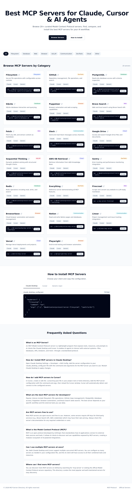

# MCP Server Directory

[](https://bestmcpservers.com)
[](https://nextjs.org/)
[](https://pages.cloudflare.com/)
[](LICENSE)

A curated directory of **20+ MCP (Model Context Protocol) servers** for Claude, Cursor, and AI agents. Browse, compare, and install the best MCP servers with copy-paste setup commands.



## Features

- **Curated Server List** — 20+ hand-picked MCP servers across 9 categories
- **Copy-Paste Install** — One-click copy for `npx` / `uvx` / `docker` install commands
- **Category Filtering** — Filter by Filesystem, Database, Web, Browser, AI/LLM, Communication, DevTools, Cloud, and more
- **Client Support Tags** — See which servers work with Claude, Cursor, or any generic MCP client
- **Install Guides** — Step-by-step configuration for Claude Desktop and Cursor
- **SEO Optimized** — Structured FAQ schema, Open Graph tags, sitemap, and robots.txt
- **Static Export** — Blazing fast, no database, no backend required
- **Fully Responsive** — Works on desktop, tablet, and mobile

## Tech Stack

- [Next.js 14](https://nextjs.org/) — React framework with static export
- [Tailwind CSS](https://tailwindcss.com/) — Utility-first CSS
- [Lucide React](https://lucide.dev/) — Icon library
- [Cloudflare Pages](https://pages.cloudflare.com/) — Static site hosting

## How to Run Locally

```bash
# Clone the repository
git clone https://github.com/xuanlinflow413/mcp-server-directory.git
cd mcp-server-directory

# Install dependencies
npm install

# Start the development server
npm run dev

# Open http://localhost:3000 in your browser
```

## Build & Deploy

```bash
# Build for production (static export)
npm run build

# The static site is generated in the `out/` directory
```

### Cloudflare Pages

This project is deployed on **Cloudflare Pages** with the following settings:

| Setting | Value |
|---------|-------|
| Framework preset | Next.js (Static HTML Export) |
| Build command | `npm run build` |
| Build output directory | `out` |
| Production branch | `main` |

## Contributing

Found a new MCP server? Open an [issue](https://github.com/xuanlinflow413/mcp-server-directory/issues) or submit a PR.

## License

[MIT](LICENSE) © 2025 MCP Server Directory
